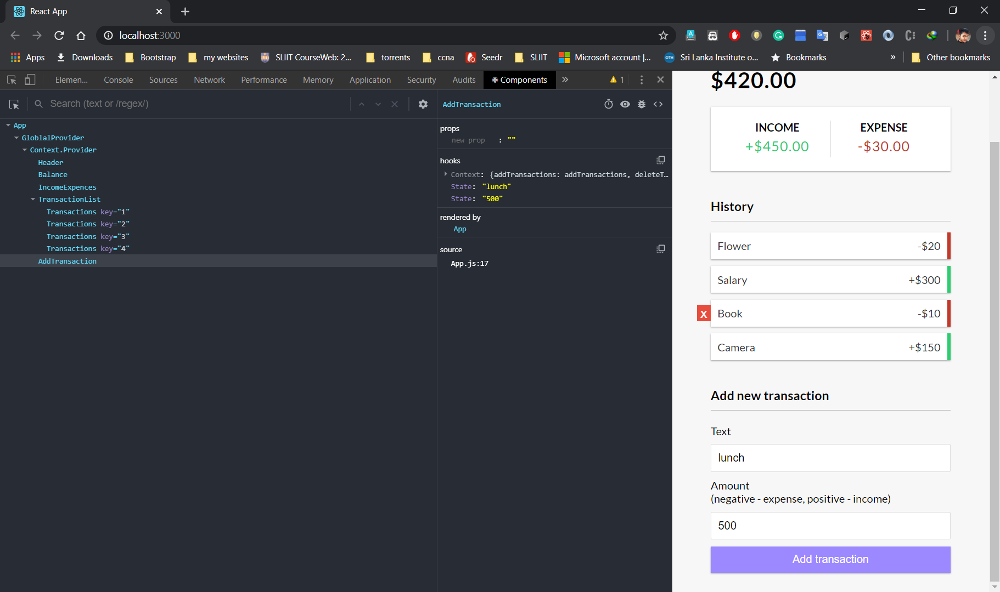

# HOOKS

> `useState` hook

```jsx
import React, { useState} from "react";
```

> create a pease of state


```jsx
//  pease of state  
//  `text` is a pease of state -->
//  then a method to menipilate the text -->
//  initial state -->
//  which is empty in this case -->

const [text,setText] = useState('');
const [amount,setAmount] = useState(0);


```
> Pass the valure to the state
```jsx

// to pass the value to the state 
<input
  type="text"
  value={text}
  onChange={e => setText(e.target.value)}
  placeholder="Enter text..."
/>


```
```jsx
<input
  type="number"
  value={amount}
  onChange={e => setAmount(e.target.value)}
  placeholder="Enter amount..."
/>
```

>Output

